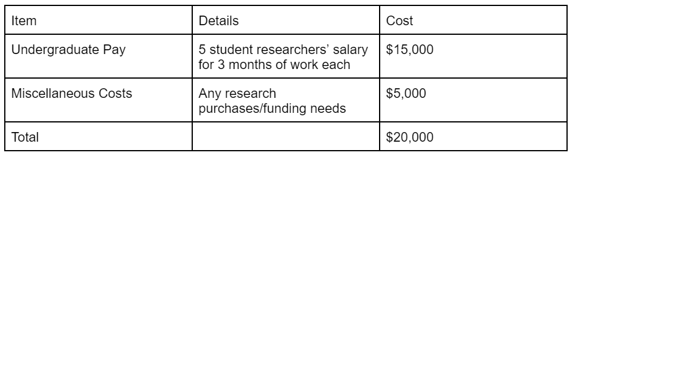

# Final: Research Proposal

## By Eden Ethington
---

Routine childhood vaccination rollout has helped to effectively eradicate numerous infectious diseases in many nations across the globe by reaching immunization rates that achieve herd immunity and prevent the spread of disease. Highly infectious diseases like measles and polio, which once claimed the lives of tens of thousands of Americans every year, now present no significant risk to Americans due to high childhood vaccination rates, but the same cannot yet be said for many low- and middle-income countries (LMICs), where childhood vaccination rates often remain far below herd immunity level. According to Our World In Data, as of 2019 more than half of the 19 west African countries reported between 0 and 20% coverage of two doses of measles-containing vaccine (MCV) among children, and none of them reached the 95% threshold for herd immunity. These low percentages indicate a need for increased funding and intervention to make vaccines more widely available and help LMICs achieve herd immunity against this and other preventable infectious diseases that continue to unnecessarily claim lives.

Although data on vaccination coverage is most commonly analyzed at the national level, past research has begun to investigate the heterogeneity of MCV coverage at the subnational level based on factors such as seasonal migration, household income, or urbanization level with noteworthy results. The Local Burden of Disease Vaccine Coverage Collaborators (2020) identified a relationship between urbanization (measured as the distance from a nearest city – a low distance value equals high urbanization) and MCV coverage, with more urban areas housing a larger proportion of the total children in need of vaccines, but more rural areas having consistently lower rates of vaccination (i.e. further from herd immunity percentage-wise). Portnoy, Jit, Helleringer, & Verguet (2020) used survey data to compare whether children had received their MCV from a routine vaccination (i.e. through a regularly scheduled check-up with their primary care physician) or from a vaccination campaign (i.e. pop-up clinics run by the WHO to immunize “missed” children), and then measured these rates against the wealth quintile of the child’s family. They found that wealthier households generally had easier access to routine immunizations, while poorer households were more likely to rely on immunization campaigns. These disparities highlight the need to target existing MCV rollout efforts to the specific needs of subnational groups and require further investigation.

The COVID-19 pandemic has had and continues to have a significant impact on the global economy, which in turn has impeded vaccination rollout in LMICs. Countries and organizations traditionally involved in funding and implementing these immunization programs, like the United States and the World Health Organization (WHO), lacked the funds to maintain the pre-pandemic rates of vaccination, and health and safety concerns surrounding the pandemic increased the cost of dose administration and reduced the number of healthcare volunteers to protect both the immunization administrators and recipients. Already, lower immunization rates and spikes in infectious disease transmissions have been recorded in Afghanistan and Pakistan, where polio was nearing eradication pre-pandemic; however, the extent of the impact on immunization rates in many LMICs has not been quantified due to the recency and endurance of the COVID-19 pandemic. We propose to quantify the change in immunization rates from before the COVID-19 pandemic to present day to assess the impact of the pandemic on MCV immunization rates in the 19 west African LMICs and proximity to eradication in these countries. We will focus our analysis on the potential differential impact the COVID-19 pandemic had on vaccination rollout at the subnational level, with an emphasis on the contrast between rural versus urban regions and wealthy versus poor households. We believe that COVID-19 will have most significantly impacted poorer households and more rural regions, both of whom rely more heavily on the supplementary immunization campaigns that the pandemic interfered with.
 
Modelling after the methods of the Local Burden of Disease Vaccine Coverage Collaborators (2020) and Portnoy et al. (2020), we will use household survey data available through the Global Health Data Exchange to evaluate the extent of subnational inequity in MCV coverage through comparing the rates of immunization pre-pandemic and present day among urban versus rural households and wealthy versus poor households. Portnoy et al. employed a method of data analysis which compared wealth quintiles (each household was designated as “poorest,” “poorer,” “middle,” “richer,” or “richest”) and we will extend this method of analysis to urbanization as well by dividing urbanization into quintiles (“most rural,” “more rural,” “middle,” “more urban,” or “most urban”). Using their method of measuring the tangents of the slopes of the lines between quintiles, we will assess the disparity between them.

 
The endurance of the COVID-19 pandemic presents a number of potential barriers or limitations to our proposed research. The first is that because both the pandemic and the responses of different nations continue to evolve, the trends we observe may shift over time and quickly become outdated. For this reason, we opted not to identify the comparison as “pre-pandemic versus post-pandemic” but rather “pre-pandemic versus present day” to acknowledge the continued impacts of the COVID-19 pandemic. Additionally, although the pandemic persists globally and its impact in different regions continues to evolve, the WHO has prioritized expediently re-implementing immunization campaigns in LMICs and has required its travelling employees to get the COVID-19 vaccine, so vaccination rollout is returning to its pre-pandemic state much more rapidly than many other activities. For this reason, we believe our comparisons of vaccination rates pre-pandemic versus present day will accurately represent the largest disparity between the two, as immunization rollout continues to improve over the next several months. 
 
The second barrier presented by the endurance of the COVID-19 pandemic is its impact on data collection over the past two years. While large volumes of data exist for pre-pandemic vaccination rates, survey sample size is much smaller for the present day data. However, we believe the importance of quickly identifying and addressing trends in MCV coverage as a result of the pandemic is time-sensitive enough to justify sacrificing some level of precision for expediency. For this reason, we will conduct our research in two phases: first, we will use the Premise Child Health COVID-19 Health Services Disruption Survey 2021 data available through the Global Health Data Exchange to assess the impact of the COVID-19 pandemic on vaccination coverage at the national level, then as more robust survey data becomes available, we will expand our data set to make more accurate claims about heterogeneous impacts at the subnational level.
 
Vaccination rollout efforts have been further hindered by the COVID-19 pandemic, which has delayed or cancelled campaigns in many LMICs and increased the cost and difficulty of immunization administration due to updated safety regulations and social distancing requirements. However, currently there is insufficient research into the heterogeneous subnational effect of the COVID-19 pandemic on MCV coverage. Identifying which urbanization and wealth quintiles were most impacted in terms of routine immunizations will be vital to restoring and making up for these programs in order of need. Using the results of our analyses, we can better determine which groups and regions of west African LMICs were most affected by the COVID-19 pandemic in terms of MCV coverage and use this information to target restorative immunization campaigns and programs to most effectively raise immunization rates and most precisely target populations in the most dire circumstances. 

### Budget Estimate:

### Bibliography

[Local Burden of Disease Vaccine Coverage Collaborators](https://www.nature.com/articles/s41586-020-03043-4)
[Polio, measles, other diseases set to surge as COVID-19 forces suspension of vaccination campaigns](https://www.science.org/content/article/polio-measles-other-diseases-set-surge-covid-19-forces-suspension-vaccination-campaigns)
[Portnoy, Jit, Helleringer, & Verguet](https://www.sciencedirect.com/science/article/pii/S1098301520317319)
[COVID-19 Disrupts Vaccine Delivery](https://www.ncbi.nlm.nih.gov/pmc/articles/PMC7164887/)
[Global Health Data Exchange](http://ghdx.healthdata.org/)
